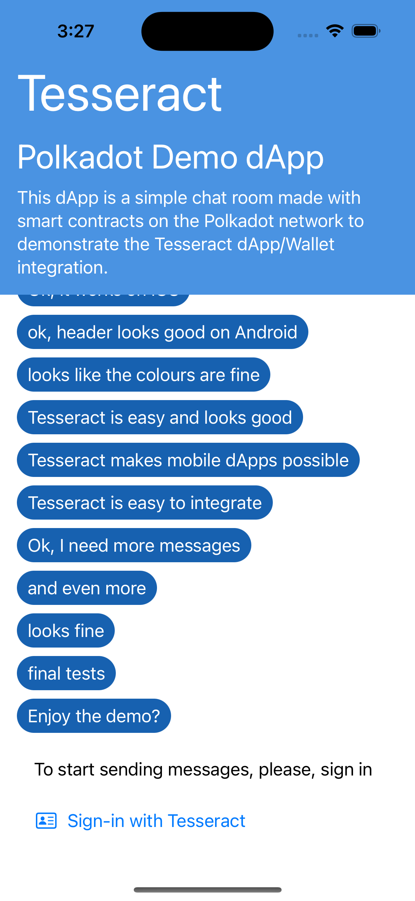
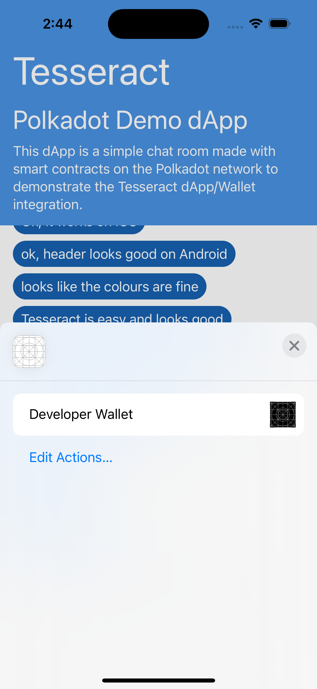
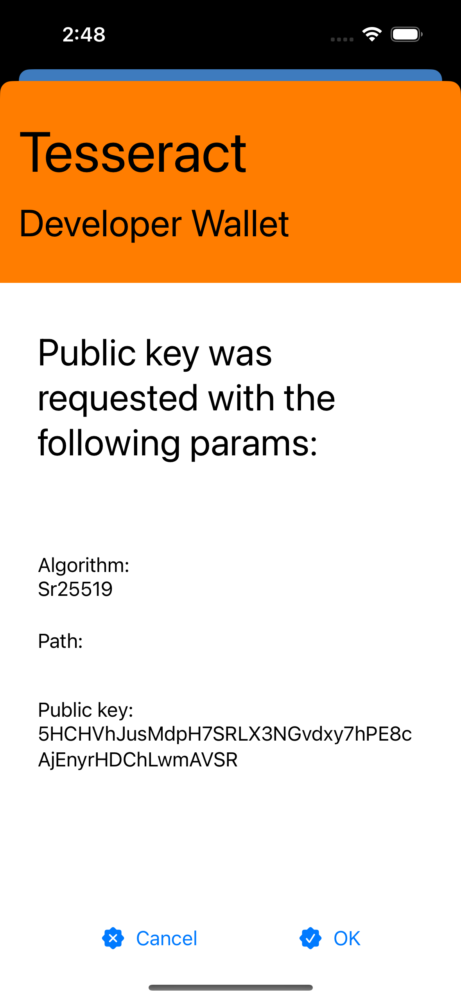

	

### **Polkadot Chat demo dApp** is a demonstration of how [Tesseract](https://github.com/tesseract-one/) provides wallet integration for dApps on mobile

    
    
    

## Demo

The demo is a chat, storing messages in a [Rococo](https://polkadot.network/blog/tag/rococo/) network smart contract. It shows how the dApps can perform readonly operations without ever connecting to the wallet and how to aquire public key and sign transactions using [Tesseract dApp/Wallet integration protocol](https://github.com/tesseract-one/). In the case of this demo, the transaction is created and submitted when the user wishes to send a message to the chat.

## Prerequisites

1. [Android Studio](https://developer.android.com/studio) is the only thing you need to build and run this demo.

## Installation

### Installation on Android

1. Checkout [this repo](https://github.com/tesseract-one/polkachat.kotlin)
2. Open `polkachat.android` folder in Android Studio.
3. Run it on a desired device (or emulator).

## License

Tesseract.rs can be used, distributed and modified under [the Apache 2.0 license](LICENSE).
